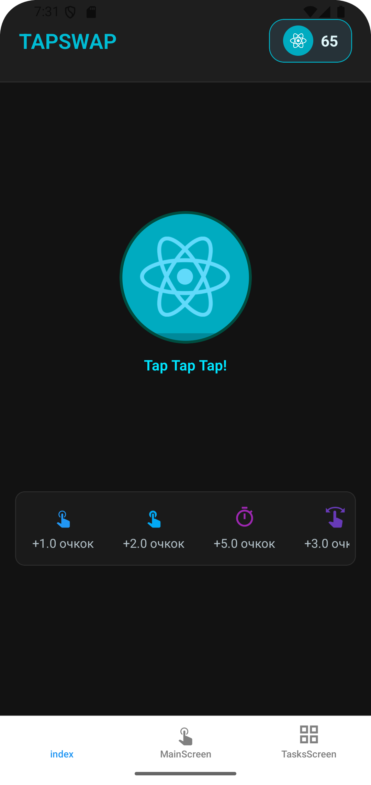
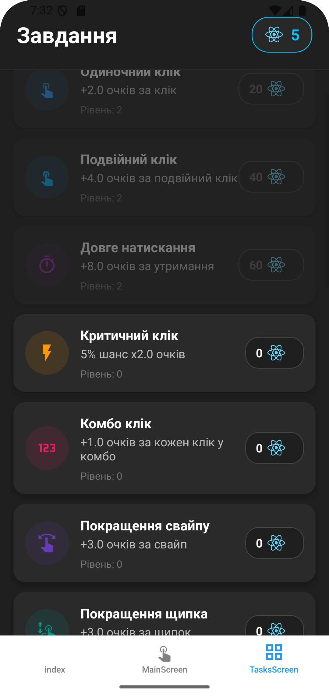
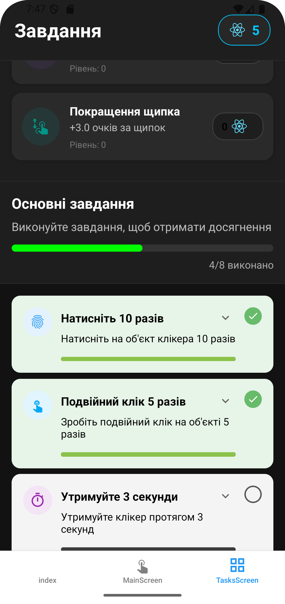

# Лаборатона робота №3
Виконав Бондарчук Олександр Олександрович| Група ІПЗ-23-2

# Запуск проєкту

```sh
npx expo start --android  # для запуску Android
npm run web      # для запуску у браузері
```


# Скріншоти:


## Жмакалка:

## Поліпшення:

## Завдання:
